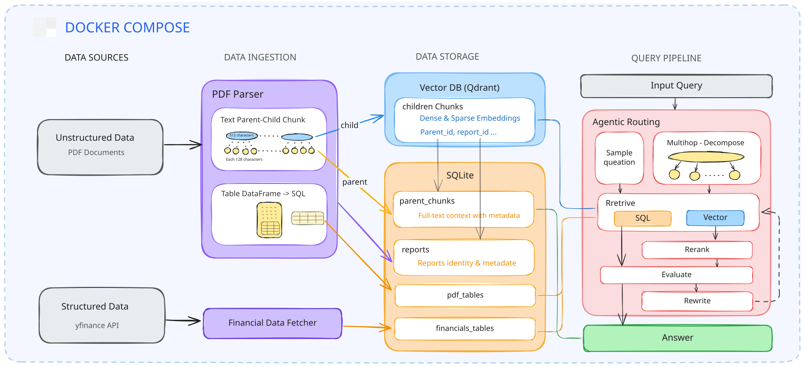

# Financial Agentic RAG

An agentic Retrieval-Augmented Generation system for querying financial reports, built with LangGraph. The agent classifies and decomposes user questions, routes to the appropriate retrieval strategy (vector or SQL), evaluates result relevance with a CRAG-style loop, and streams reasoning steps to a React frontend via Server-Sent Events.



## Key Features

- **Agentic query pipeline** — LangGraph state machine with `classify → decompose → route → retrieve → evaluate → rewrite → generate` nodes; multi-hop and cross-document questions are automatically broken into sub-questions
- **Hybrid retrieval** — per sub-question routing between Qdrant vector search and SQLite SQL queries, with automatic fallback from SQL to vector when no rows are returned
- **Parent-Child chunking** — PDFs are chunked into 512-char parent chunks (stored in SQLite for context) and 128-char child chunks (embedded and stored in Qdrant); retrieval fetches children for precision, returns parent text for richer context
- **CRAG-style evaluation** — relevance scored by cosine similarity threshold (0.55); low-scoring sub-questions trigger an LLM query rewrite and re-retrieval (max 1 retry)
- **Structured financial data** — yfinance pipeline ingests key financial metrics into SQLite alongside the vector store, enabling precise numerical queries
- **Streaming UI** — FastAPI SSE endpoint streams per-node reasoning events to a Vite + React chat interface with PDF preview

## Tech Stack

| Layer | Technology |
|-------|-----------|
| Agent | LangGraph, LangChain |
| LLM & Embeddings | OpenAI GPT-4o-mini, text-embedding-3-large (3072-dim) |
| Vector Store | Qdrant |
| Relational Store | SQLite |
| PDF Parsing | Docling (layout-aware, table extraction) |
| Financial Data | yfinance |
| API | FastAPI, SSE |
| Frontend | React, Vite |
| Evaluation | RAGAS (optional) |

## Architecture

```
RAG/
├── agent/
│   ├── graph.py          # LangGraph state machine and conditional edges
│   ├── nodes.py          # classify, decompose, route, retrieve, evaluate, rewrite, generate
│   └── prompts.py
├── api/
│   └── main.py           # FastAPI: /query (SSE), /upload, /files, /pdf
├── ingestion/
│   ├── pdf_parser.py     # Docling: extracts text and tables with section metadata
│   ├── text_chunker.py   # Parent-Child hierarchical chunking
│   ├── embedder.py       # Embeds child chunks → Qdrant; parents → SQLite
│   ├── financial_data_fetcher.py
│   └── run_ingestion.py
├── retrieval/
│   ├── vector_retriever.py
│   └── sql_retriever.py
├── frontend/
├── data/
│   ├── raw/              # PDFs — naming: {company}_{year}.pdf
│   └── financials.db
└── docker-compose.yml    # Qdrant
```

## Quick Start

**1. Start Qdrant**
```bash
docker compose up -d
```

**2. Set up environment**
```bash
python -m venv venv
source venv/bin/activate   # Windows: venv\Scripts\activate
pip install -r requirements.txt
```

Create `.env` at the repo root:
```env
OPENAI_API_KEY=sk-...
```

**3. Ingest data**

Drop PDFs into `data/raw/` (filename format: `apple_2024.pdf`), then run:
```bash
python ingestion/run_ingestion.py
```

Or upload directly from the UI — ingestion runs automatically in the background.

**4. Start the API**
```bash
uvicorn api.main:app --reload --port 8000
```

**5. Start the frontend**
```bash
cd frontend && npm install && npm run dev
```

Open `http://localhost:5173`.

## API Reference

| Method | Path | Description |
|--------|------|-------------|
| POST | `/query` | `{"question": "..."}` — SSE stream of reasoning events and final answer |
| GET | `/files` | List ingested PDFs grouped by company |
| POST | `/upload` | Upload a PDF; triggers ingestion in background |
| GET | `/pdf/{filename}` | Serve raw PDF bytes |
