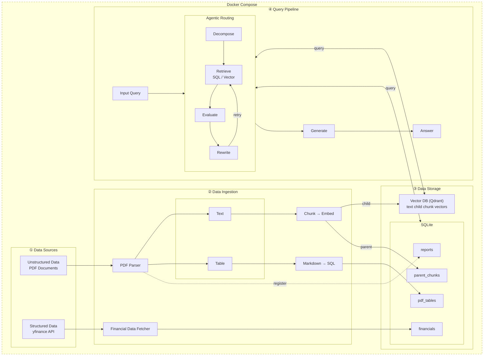

# RAG System Architecture

```mermaid
flowchart LR
    subgraph DC["Docker Compose"]
        direction LR

        subgraph Sources["① Data Sources"]
            direction TB
            PDF["Unstructured Data\nPDF Documents"]
            YF["Structured Data\nyfinance API"]
        end

        subgraph Ingestion["② Data Ingestion"]
            direction TB
            PP["PDF Parser"]
            subgraph PPOut[" "]
                direction LR
                TEXT["Text"]
                TABLE["Table"]
            end
            CE["Chunk → Embed"]
            MDSQL["Markdown → SQL"]
            FDF["Financial Data Fetcher"]
        end

        subgraph StorageLayer["③ Data Storage"]
            direction TB
            VDB["Vector DB (Qdrant)\ntext child chunk vectors"]
            subgraph SQLITE["SQLite"]
                direction LR
                REP[reports]
                PC[parent_chunks]
                PT[pdf_tables]
                FIN[financials]
            end
        end

        subgraph QueryPipeline["④ Query Pipeline"]
            direction TB
            IQ["Input Query"]
            subgraph AR["Agentic Routing"]
                direction TB
                DEC[Decompose]
                RET["Retrieve\nSQL / Vector"]
                EVA[Evaluate]
                REW[Rewrite]
                DEC --> RET
                RET --> EVA
                EVA --> REW
                REW -->|retry| RET
            end
            GEN[Generate]
            ANS[Answer]
        end

        PDF --> PP
        PP --> TEXT
        PP --> TABLE
        PP -.->|register| REP
        TEXT --> CE
        CE -->|child| VDB
        CE -->|parent| PC
        TABLE --> MDSQL
        MDSQL --> PT
        YF --> FDF
        FDF --> FIN

        IQ --> AR
        AR <-->|query| VDB
        AR <-->|query| SQLITE
        AR --> GEN
        GEN --> ANS
    end

    style DC stroke-dasharray: 5 5
```
